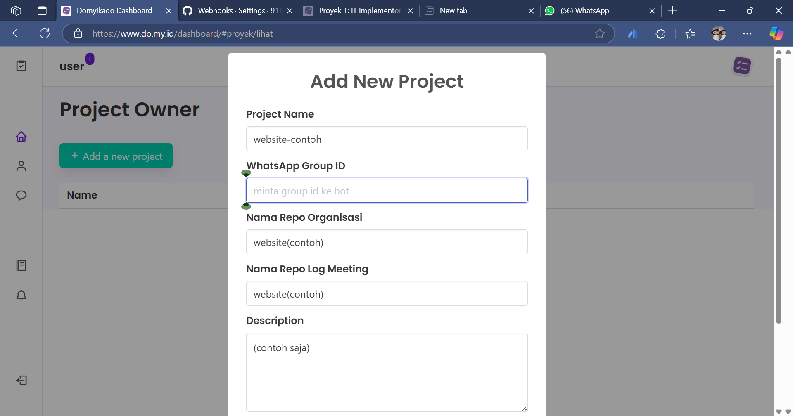
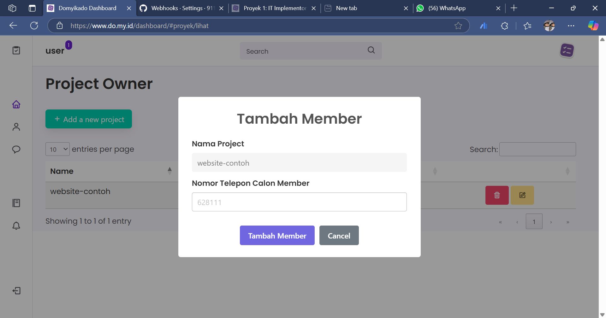
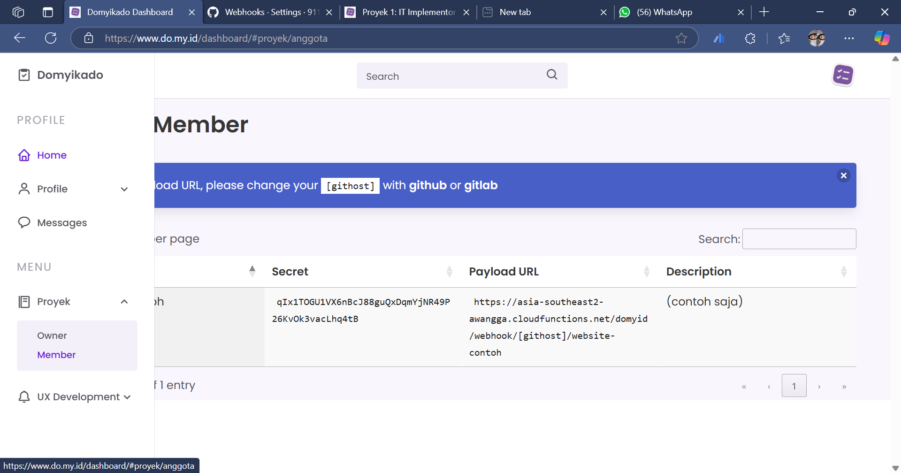
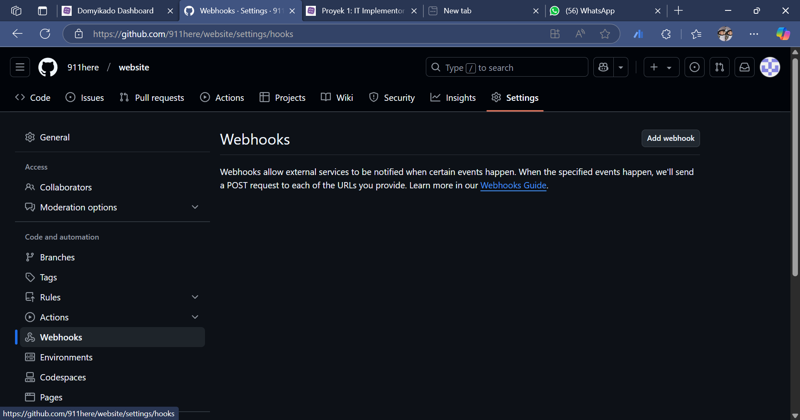
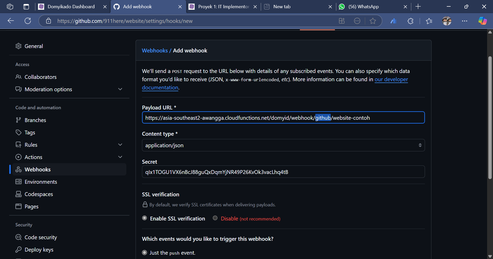
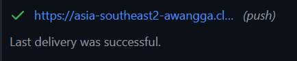
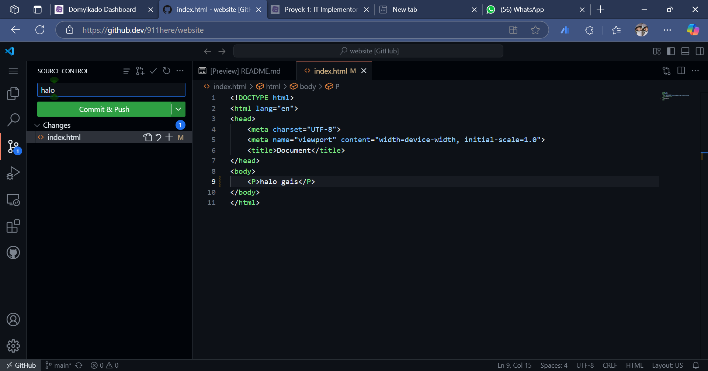
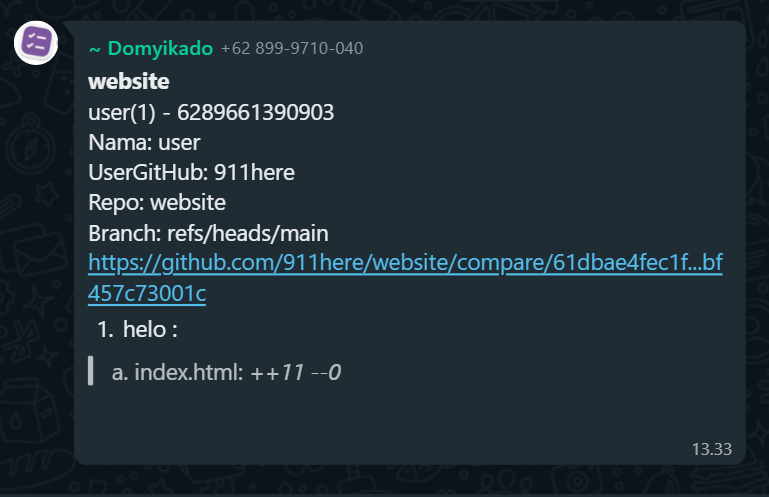

# Parameter pengukuran kinerja sobat domyikado

Sebelum memulai pengerjaan proyek, sepakati dulu hal-hal berikut:
1. Tentukan hari kerja, pastikan dalam satu tim satu grup wa tentukan hari apa saja di hari kerja untuk mengerjakan project ini.
2. Dalam satu hari kerja, setiap individu harus mendapatkan 3 poin. Jika kurang dari itu maka akan dikurangi 3 poin
3. Akan ada rekapitulasi perhari dari setiap individu yang ada di dalam project.
4. Pastikan memasang WebHook dulu sebelum memulai pekerjaan di repository
   

## Tutorial Memasang Webhook dari do.my.id

1. Buka do.my.id
2. Buka tab dan pilih Proyek -> Owner
3. Add a new project  
   Selanjutnya isi sesuai dengan kebutuhan proyek sobat domyikado, jika sudah klik -> add  
   ()
4. Add member lalu masukan nomor whatsapp anda
   
5. Buka tab kembali pilih Proyek -> Member
   
   Simpan Payload URL dan Secret

Selanjutnya

1. Buka repository project Anda
2. Klik tombol settings
3. Pilih Webhooks  
   
4. Klik tombol Add webhook
5. Masukkan URL Webhook yang sudah Anda buat sebelumnya dari do.my.id  
   
   Biarkan default yang lainnya jika sudah klik tombol Add webhook
6. Selanjutnya Jika sudah ceklis seperti ini berati sudah sukses  
   
8. Coba commit & Push  
   
9. Jika berhasil myka akan mengirim pesan ini  
   

## Poin sobat domyikado

Domikado berfungsi untuk melakukan monitoring harian pekerjaan setiap individu yang ada dalam tim berbasiskan poin. 
Cara memantau pekerjaan dibagi menjadi dua bagian:
1. Menggunakan webhook push, maka akan terekap semua pesan commit yang muncul.
2. Menggunakan kepuasan berbasiskan user yang bisa di beri rating.
3. Sepakati dahulu dalam satu hari, setiap anggota tim bisa menyelesaikan berapa poin? Contoh: untuk anak magang:3-6 poin, untuk junior entry level: 7-14 poin, untuk senior level:15-30 poin, level dewa:31-60 poin.
4. Buat dahulu format standar kode unik task, dimana setiap segmen kode memiliki arti.

## Yang bisa di commit untuk di ukur

1. Proses belajar: membuat tutorial di markdown file di repo, sehingga berkontribusi membuat tutorial untuk yang lainnya
2. Proses ngoding: program utama, package, file testing. satu commit minimal satu buah fungsi baik baru, perubahan, atau penghapusan fungsi yang tidak perlu.
3. Risalah rapat, pertemuan, seminar, webinar, conference dalam file markdown di dalam repo
4. Panduan, SOP, aturan, resume dalam file markdown dalam repo

## Standar Pesan Commit

Format: kodeuniktask:nama fungsi serta detail yang dikerjakan 
Dengan ketentuan:
1. Pada saat scrum meeting, backlog setiap task terdapat kode unik dan poin. 
2. Dimana poin merupakan target perkiraan banyaknya commit yang akan dilakukan untuk menyelesaikan task tersebut. 
3. Sehingga jumlah commit adalah, jumlah langkah yang dilakukan untuk menyelesaikan satu buah task
4. Kode unik task sebaiknya mudah diingat dan berisi info modul dan info lainnya yang informatif
5. Jika task sudah selesai maka tambahkan tanda pagar plus kodeuniktask pada bagian detail, maka task otomatik done. Contoh: MOD87INT:sudah selesai modul presensi#MOD87INT

## Task non commit
Beberapa task yang tidak bisa dikukur dengan commit maka diinputkan:
1. Layanan konsumen
2. Pekerjaan membuat konten
3. Pekerjaan lapangan
4. Pekerjaan administratif
5. Pembuatan dokumen diluar markdown
6. Pembuatan risalah rapat diluar markdown
7. Pembuatan panduan diluar markdown
8. Pertemuan, undangan, pelatihan, seminar diluar markdown
